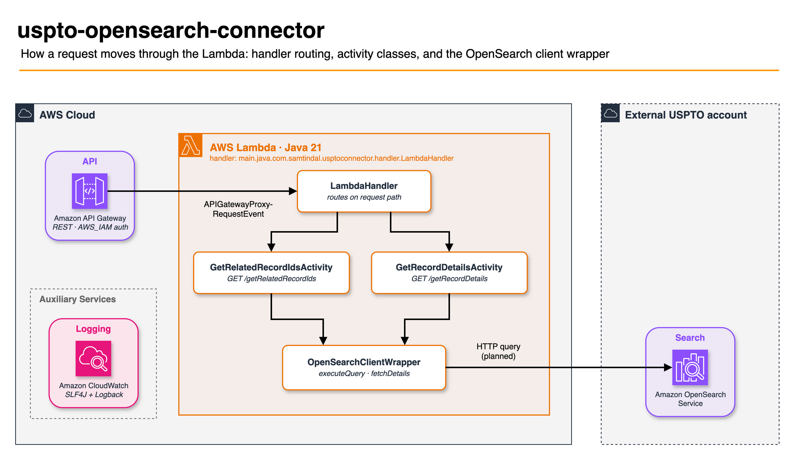
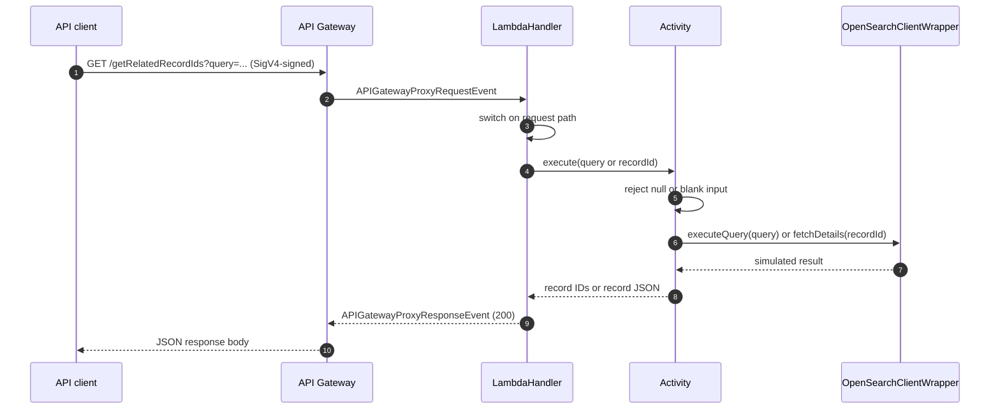
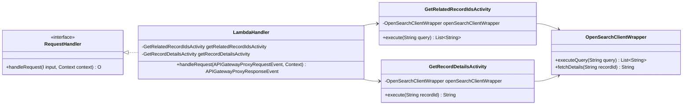

# USPTO OpenSearch Connector

A read-only Java 21 AWS Lambda that serves USPTO patent records through two HTTP endpoints. Amazon API Gateway exposes it with IAM (SigV4) authorization, and the function queries an externally owned USPTO OpenSearch domain.

The infrastructure lives in a separate CDK package: [`uspto-opensearch-connector-cdk`](https://github.com/samtindal/uspto-opensearch-connector-cdk). That package pulls this repository in as a git submodule and builds it into the Lambda.

> **Status:** the request routing, validation, and packaging work end to end. `OpenSearchClientWrapper` returns **simulated data**: it does not call OpenSearch or assume the USPTO access role yet. See [Known limitations](#known-limitations).

## Architecture



- **`LambdaHandler`** is the Lambda entry point. It receives the API Gateway proxy event and switches on the request path.
- **Activity classes** each handle one endpoint. They reject null or blank input, then delegate to the client wrapper.
- **`OpenSearchClientWrapper`** is the single place that talks to the data store, so the real OpenSearch client can replace the simulated one without touching the handler or activities.
- **Logging** goes through SLF4J with a Logback backend to CloudWatch Logs.

The PNG embeds its draw.io source. Open [`docs/connector-request-flow.drawio.png`](docs/connector-request-flow.drawio.png) in [diagrams.net](https://app.diagrams.net) to edit it.

### Request sequence



### Class structure



## API

Both endpoints are `GET` requests that need AWS SigV4 signing from a principal with `execute-api:Invoke` on the API.

| Endpoint | Query parameter | Success response (`200`) |
|---|---|---|
| `/getRelatedRecordIds` | `query`: search text | `{"relatedRecordIds": [...]}` |
| `/getRecordDetails` | `recordId`: record ID | The record as a JSON object |

Error responses:

| Status | Body | When |
|---|---|---|
| `404` | `{"message": "Endpoint not found"}` | The path is neither endpoint |
| `500` | `{"message": "Error retrieving related record IDs"}` or `{"message": "Error retrieving record details"}` | The parameter is blank or missing, or the lookup fails |
| `500` | `{"message": "Internal server error"}` | The request has no query string at all |

## Build

The project targets **Java 21** through a Gradle toolchain. The [Shadow plugin](https://github.com/GradleUp/shadow) builds a fat jar, which Lambda needs because none of the dependencies are on the Java runtime's classpath.

No Gradle wrapper is committed. Build with a local Gradle 8 install:

```bash
gradle shadowJar
```

Or build with Docker, which is how the CDK package builds it:

```bash
docker run --rm -u "$(id -u):$(id -g)" -e HOME=/tmp \
  -v "$PWD":/workspace -w /workspace \
  gradle:8-jdk21 gradle shadowJar --no-daemon
```

The output is `build/libs/uspto-opensearch-connector-1.0-SNAPSHOT-all.jar`. The Lambda handler is:

```
main.java.com.samtindal.usptoconnector.handler.LambdaHandler
```

The package names really do start with `main.java.`, because the sources declare them that way. The handler string has to match.

## Deploy

Deploy with [`uspto-opensearch-connector-cdk`](https://github.com/samtindal/uspto-opensearch-connector-cdk). It builds this jar during `cdk synth`, then provisions the Lambda, the IAM-authorized REST API, logging, and tracing.

## Project layout

```
src/main/java/com/samtindal/usptoconnector/
├── handler/LambdaHandler.java                 # entry point; routes on request path
├── activities/GetRelatedRecordIdsActivity.java
├── activities/GetRecordDetailsActivity.java
└── client/OpenSearchClientWrapper.java        # data access (simulated today)
src/test/java/...                              # unit tests (see Known limitations)
docs/connector-request-flow.drawio.png         # architecture diagram, editable in draw.io
```

## Known limitations

- **Simulated data.** `OpenSearchClientWrapper` returns fixed sample results. It does not yet call OpenSearch, and it does not assume the role in `OPENSEARCH_ROLE_ARN`, which the CDK stack passes to the function.
- **The unit tests don't compile.** They use Mockito, which isn't a declared dependency, and their package declarations don't match the sources. As a result, `gradle test` fails, while `gradle shadowJar` works because it doesn't compile the tests.
- **A request with no query string returns a generic `500`,** not a `400`. The handler reads the parameter map without checking for null.

## License

MIT. See [LICENSE](LICENSE).
