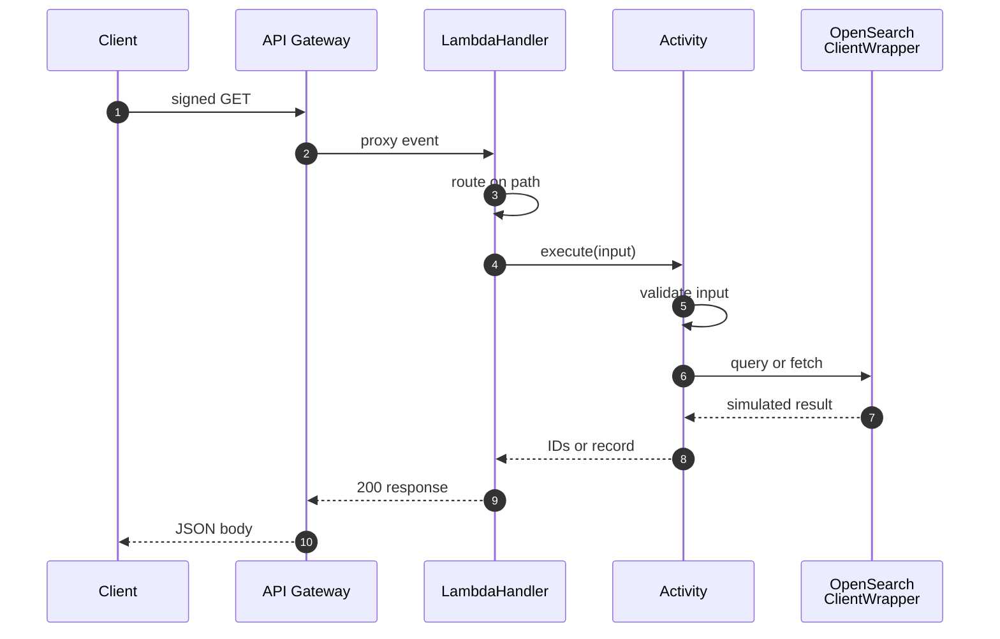
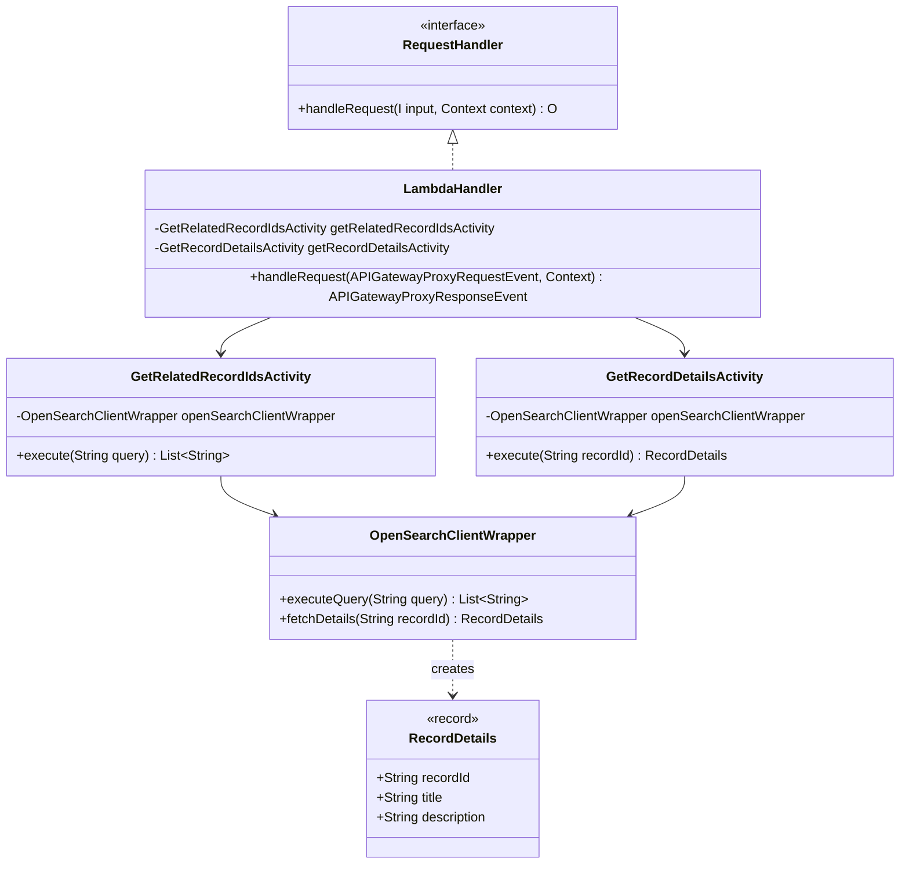

# USPTO OpenSearch Connector

A read-only Java 21 AWS Lambda that serves USPTO patent records through two HTTP endpoints. Amazon API Gateway exposes it with IAM (SigV4) authorization, and the function queries an externally owned USPTO OpenSearch domain.

The infrastructure lives in a separate CDK package: [`uspto-opensearch-connector-cdk`](https://github.com/samtindal/uspto-opensearch-connector-cdk). That package pulls this repository in as a git submodule and builds it into the Lambda.

> **Status:** routing, input validation, JSON responses, packaging, and the unit tests all work. `OpenSearchClientWrapper` returns **simulated data**: it does not call OpenSearch or assume the USPTO access role yet. See [Known limitations](#known-limitations).

## Architecture


- **`LambdaHandler`** is the Lambda entry point. It receives the API Gateway proxy event, switches on the request path, and serializes every response body as JSON with Jackson.
- **Activity classes** each handle one endpoint. They reject null or blank input, which the handler turns into a `400`, then delegate to the client wrapper.
- **`OpenSearchClientWrapper`** is the single place that talks to the data store, so the real OpenSearch client can replace the simulated one without touching the handler or activities.
- **Logging** goes through SLF4J with a Logback backend to CloudWatch Logs.

The PNG embeds its draw.io source. Open [`docs/connector-request-flow.drawio.png`](docs/connector-request-flow.drawio.png) in [diagrams.net](https://app.diagrams.net) to edit it.

### Request sequence



### Class structure



## API

Both endpoints are `GET` requests that need AWS SigV4 signing from a principal with `execute-api:Invoke` on the API.

| Endpoint | Query parameter | Success response (`200`) |
|---|---|---|
| `/getRelatedRecordIds` | `query`: search text | `{"relatedRecordIds": ["12345", "67890", "11223"]}` |
| `/getRecordDetails` | `recordId`: record ID | `{"recordId": "12345", "title": "...", "description": "..."}` |

Every response, including errors, has a JSON body and `Content-Type: application/json`.

| Status | Body | When |
|---|---|---|
| `400` | `{"message": "Query cannot be null or blank."}` or `{"message": "Record ID cannot be null or blank."}` | The required parameter is missing or blank |
| `404` | `{"message": "Endpoint not found"}` | The path is neither endpoint |
| `500` | `{"message": "Internal server error"}` | Anything unexpected; details are logged, not returned |

## Build

The project targets **Java 21** through a Gradle toolchain. The [Shadow plugin](https://github.com/GradleUp/shadow) builds a fat jar, which Lambda needs because none of the dependencies are on the Java runtime's classpath.

No Gradle wrapper is committed. Build and test with a local Gradle 8 install:

```bash
gradle test        # JUnit 5 + Mockito unit tests
gradle shadowJar   # deployable fat jar
```

Or run the same tasks in Docker, which is how the CDK package builds the jar:

```bash
docker run --rm -u "$(id -u):$(id -g)" -e HOME=/tmp \
  -v "$PWD":/workspace -w /workspace \
  gradle:8-jdk21 gradle test shadowJar --no-daemon
```

The output is `build/libs/uspto-opensearch-connector-1.0-SNAPSHOT-all.jar`. The Lambda handler is:

```
com.samtindal.usptoconnector.handler.LambdaHandler
```

## Deploy

Deploy with [`uspto-opensearch-connector-cdk`](https://github.com/samtindal/uspto-opensearch-connector-cdk). It builds this jar during `cdk synth`, then provisions the Lambda, the IAM-authorized REST API, logging, and tracing.

## Project layout

```
src/main/java/com/samtindal/usptoconnector/
├── handler/LambdaHandler.java                 # entry point; routes on request path
├── activities/GetRelatedRecordIdsActivity.java
├── activities/GetRecordDetailsActivity.java
├── client/OpenSearchClientWrapper.java        # data access (simulated today)
└── client/RecordDetails.java                  # record returned by /getRecordDetails
src/test/java/com/samtindal/usptoconnector/   # unit tests, mirroring the main packages
docs/connector-request-flow.drawio.png         # architecture diagram, editable in draw.io
```

## Known limitations

- **Simulated data.** `OpenSearchClientWrapper` returns fixed sample results. It does not yet call OpenSearch, and it does not assume the role in `OPENSEARCH_ROLE_ARN`, which the CDK stack passes to the function.

## License

MIT. See [LICENSE](LICENSE).
